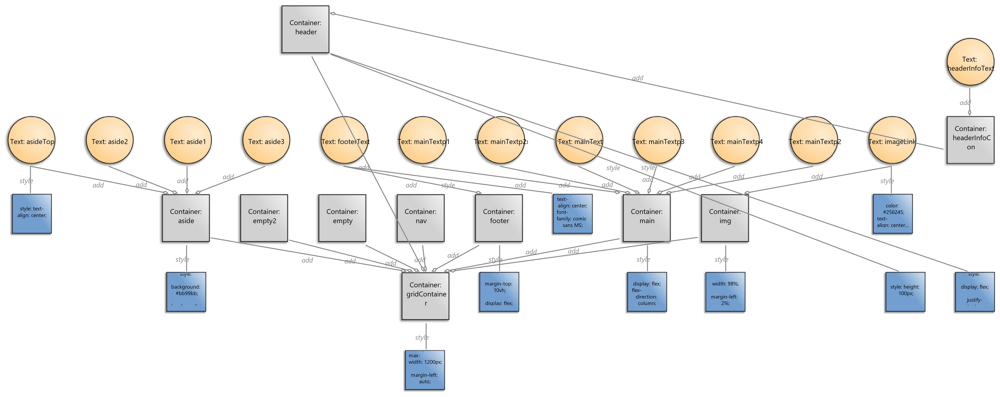
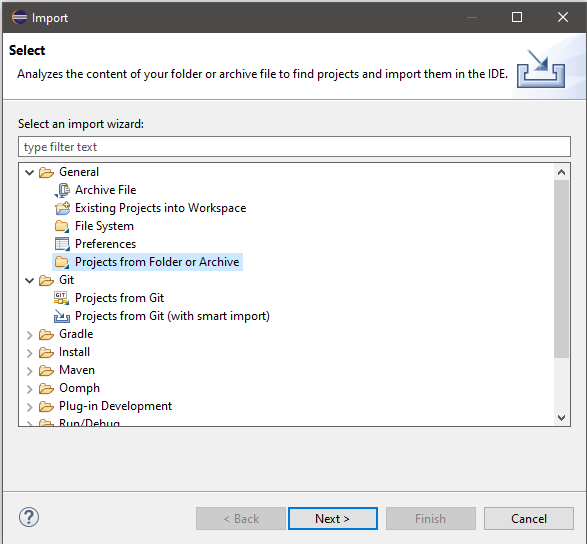
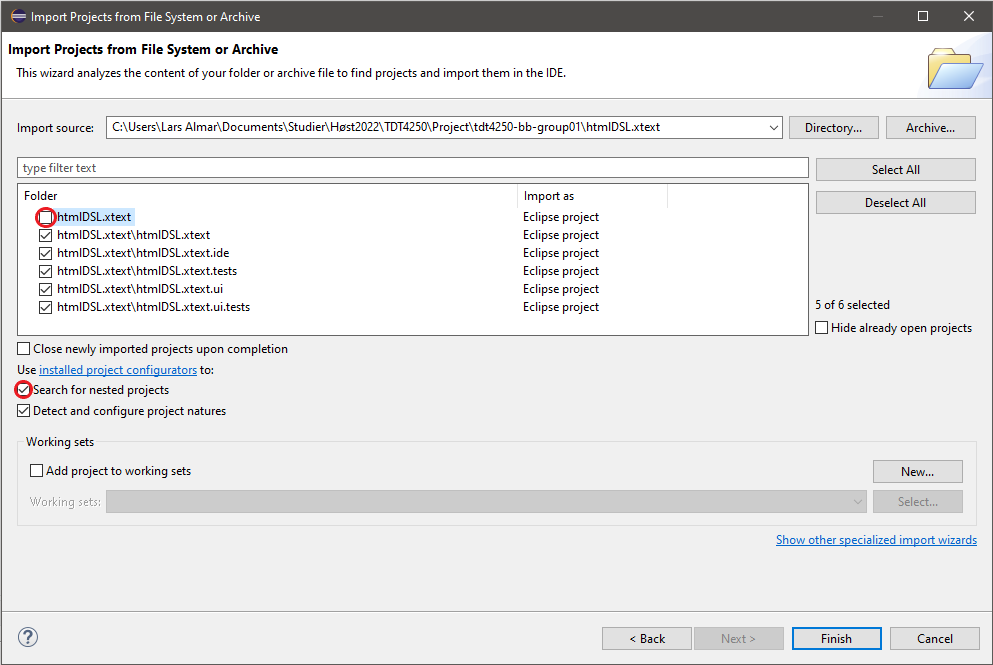
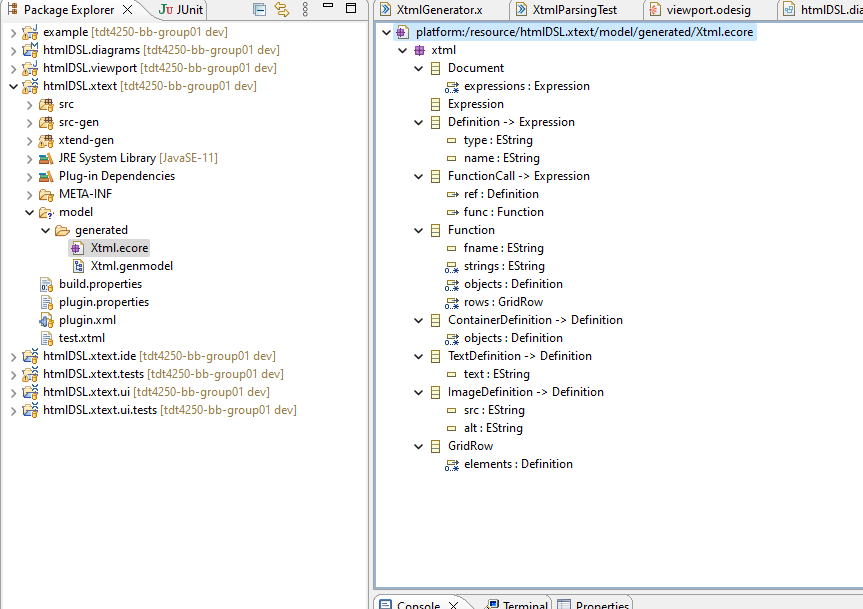
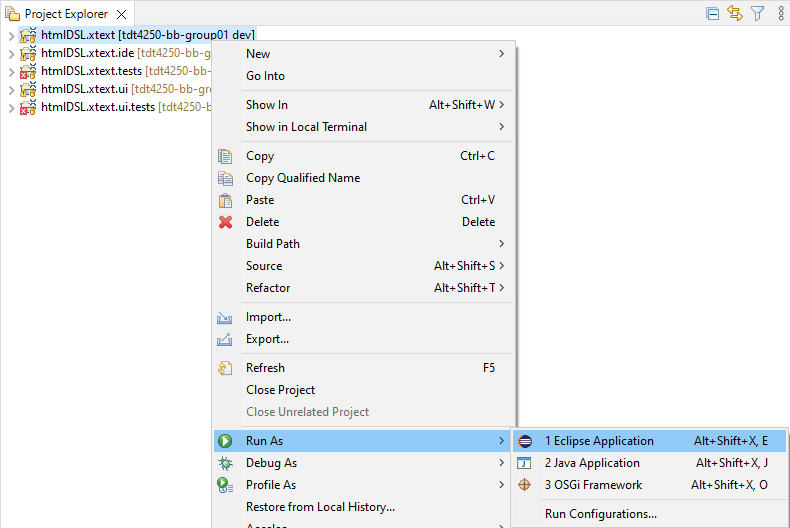
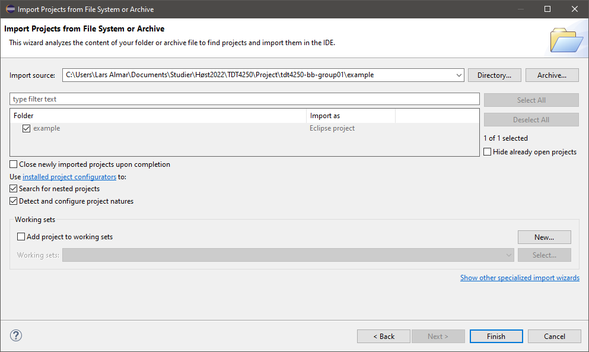
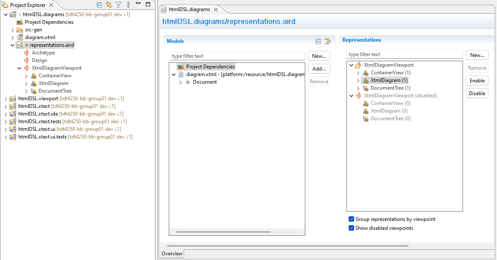
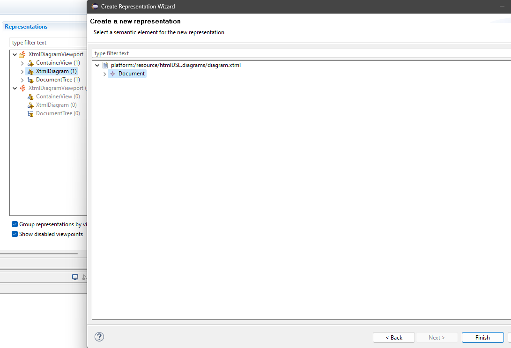
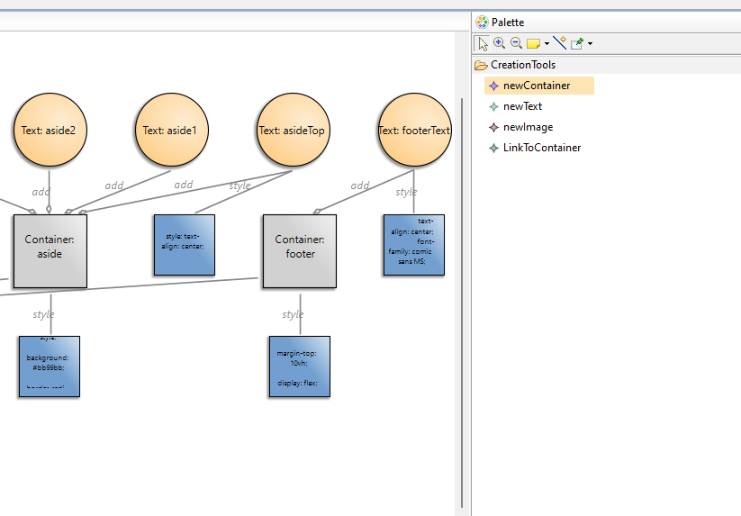
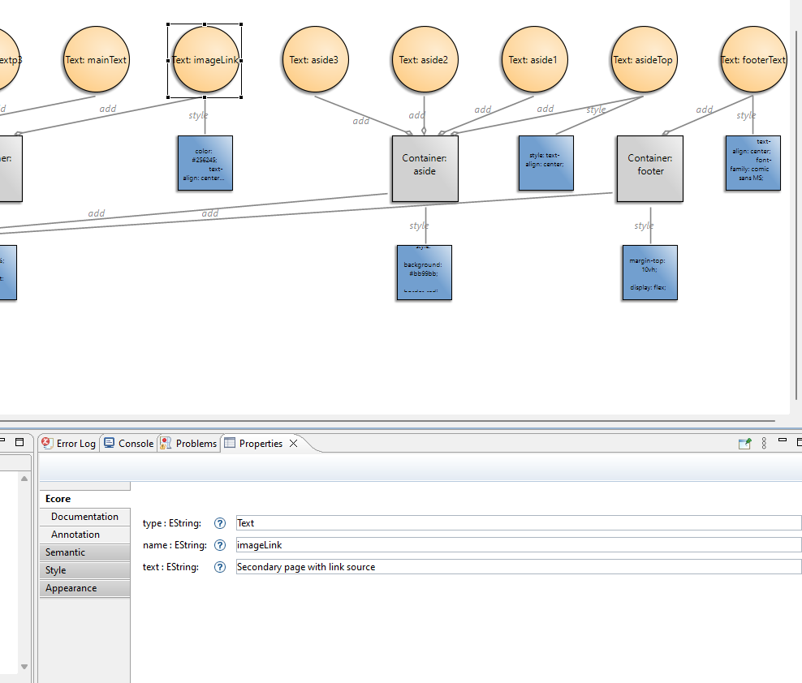

# htmlDSL - TDT4250 Group Project
By blackboard defined group 1.

Members:  
-- disclosed due to privacy --

## Table of contents
* [What is htmlDSL?](#what-is-htmldsl)
    * [Xtext](#xtext)
    * [Sirius-based visual model](#sirius-based-visual-model)
    * [Functionality](#functionality)
* [Installation](#installation)
    * [Pre-requisites](#pre-requisites)
    * [Importing the project](#importing-the-project)
* [How to use htmlDSL](#how-to-use-htmldsl)
    * [Setting up the generator](#setting-up-the-generator)
    * [Generating your own HTML](#generating-your-own-html)
    * [Setting up the example environment](#setting-up-the-example-environment)
    * [XTML grammar introduciton](#xtml-grammar-introduction)
    * [Using Sirius](#using-sirius)

# What is htmlDSL?
## Xtext
For our project in TDT4250, we decided to create a DSL that would help create a HTML page more easily. We decided to use Xtext, and create a grammar that specified how the DSL could be used. The grammar consists mainly of two concepts: the container and the contents within (text, images). After creating an instance in the simplified HTML, it can then be transformed into a working HTML file.

## Sirius-based visual model
To make the simplified HTML easier to work with, the group also decided to create a model of our DSL in Sirius. The Sirius-based model provides a graphical way to build the simplified HTML instance. The viewpoints also provide a way to visualise how elements will be arranged in the final HTML page. With more familiarity with Sirius, and some _hacky_ workarounds, it could also be possible to implement some sort of positional arrangement, where the position of an object in the instance decides where on the HTML page it would appear, but we decided this was a bit out of scope.

The sirius diagram is therefore used more as a baseline for creating simpler HTML, while more advanced use would require to use the XTML syntax. For viewing the XTML visually, sirius is a nice addition.

The diagram elements and its functionalities are defined within the [viewport folder](./htmlDSL.viewport/description/). We are representing the HTML-like objects meaning that function calls from the XTML file is not shown as entities, but rather as edges or links between elements.

## Functionality
The htmlDSL supports most HTML features, including most types of containers and content types. The DSL does not support buttons, tables, select-menus an sliders, but this could be added with some extra work.

An example of an HTML generated with the htmlDSL can be viewed by opening the [example html files](/example/src-gen/) in your browser of choice.

# Installation
## Pre-requisites
* Java version 17+
* Eclipse installation. We'll be using the Eclipse Java and DSL package from [Eclipse Foundation](https://www.eclipse.org/downloads/packages/).
* The following Eclipse plug-ins:

To install the plug-ins, open Eclipse, and press **Help > Install New Software...** at the top of the environment.

Select your select your version of Eclipse in the drop-down, and check **Group Items by Category**. Select the following plug-ins:

* Acceleo
* Ecore Diagram Editor (SDK)
* EMF Forms SDK
* Sirius Specifier Environment
* Sirius Properties Views

Finally, select Eclipse 2022-06 in the drop-down, and un-check with **Group Items by Category**. Select the following plug-in:

* Acceleo Query SDK
## Importing the project
1. Use git or download manually
2. Import the project from file in Eclipse

3. Make sure to check "Search for nested projects"
4. Make sure to UN-check "HTML.xtext" on the top level and check all other projects as shown in the picture:
  

# How to use htmlDSL
## Setting up the generator
Before you can use create your own HTML, there are a few steps needed. In the subproject HTML.xtext/src/htmlDSL, run GenerateXTML.mwe2 as "MWE2 Workflow". Now we are ready to generate HTML files.

An ecore model is also generated from running the workflow as shown is the image below.

## Generating your own HTML
An example using the Xtext grammar is viewable in [the examples folder](/example/src/). In this guide, we will use the example environment to generate the HTML pages. To create your own HTML, create a file with the extension ".xtml", and generate the xtml as shown in the example below.

## Setting up the example environment
To use the DSL, right click htmlDSL.xtext in the project view --> Run as --> Eclipse Application

When inside the new Eclipse runtime with our plugin added in, click on import projects... --> Projects from Folder or Archive
--> Choose the example directory from the git project --> Finish

From here you should have access to the src folder with two example XTML files. The output HTML files can be found in src-gen.
An HTML file is generated every time you save the corresponding XTML file.

## XTML grammar introduction
As mentioned earlier, xtml generates html based on two types of objects: containers and content.
Containers are all objects of type "Container", and content are all object of type "Image" or "Text".

Like a programming language, all elements are specified in the format [Type Name]. Names cannot have spaces in them.

All elements have functions associated with them, most with the standard format [Name functionName(functionContent)].
Functions can be used across multiple lines.

The text element's main purpose is to contain text. This can be done either at creation, or via the text() function.
If you want it to work as a link, the href() function can be used (remember the difference between absolute and relative link paths!).
Text also supports color(), font() and size() as functions. These translate to the corresponding CSS tags color, font and font-size.

Container's main purpose is to contain other elements.
This can be done at creation [Container con(elem1, elem2, ...)] or via the add() function. You can add multiple times to a container, but beware of cycles.
Order is preserved in these containers.

Containers also support these functions: grid(), flex() and type(). Grid will allow you to quickly specify which elements to include in a grid-template-area.
Setting up the display and grid-area tags are done automatically (make sure the element names are the same as in the grid() function).
flex() is set up to include two "default" sub-tags as arguments: justify-content and align-items, in that order.
type() is used to change a containers type, if semantics are wanted (see image for examples).
Make sure the type names are correct in HTML, as this WILL lead to big problems if not (such as creating a <hedear> tag...)

Image elements are used to display images (img tags). The image links are specified with src(), and the alt-text (when the image cannot load) is done with alt().
These can be specified at creation.

If any of the provided CSS-like functions are not enough customization, then you can also use the style() function to directly add CSS to any element.
The classes() function can be used to add classes to elements too, in case that is needed.

## Using Sirius
Before using sirius diagrams, you need to first follow [these steps](#setting-up-the-generator) and then setup the environment by following [this step](#setting-up-the-example-environment).

1. In the [htmlDSL.diagrams](./htmlDSL.diagrams/) directory click or open the "representations.aird" file. Based on the type of diagram to view there are 2 main options:
    * "XtmlDiagram": For making a baseline xtml file using diagram elements.
    * "ContainerView": For viewing containers in compact formats (lists).
    * "DocumentTree"(WIP): viewing elements as a tree list, and add new elements to it.

2. To create or edit an xtml file, select "XtmlDiagram" which is inside "representations" by double-clicking "XtmlDiagram". Then select the "Document" object and click finish. Write a name for the diagram and press "OK"

3. The palette should be visible on the right side, if not click the small little white triangle to open up the palette. Then simply drag and drop to create a new element. Changes are made to the htmlDSL.diagrams/diagram.xtml file. One can also change properties of elements by opening the properties view while focusing on an element.

