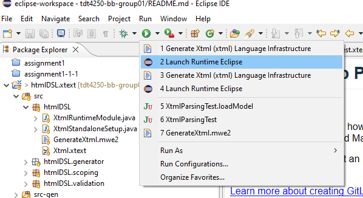

# Introduction to xtext

DSL language for making grammar

# Contents

- [How to generate grammar](#how-to-generate-grammar)
- [How to test grammar](#how-to-test-grammar)

## How to generate grammar

- Follow path htmlDSL.xtext/src/htmlDSL/Xtml.xtext
  File that ends with .xtext is the grammar file
  

- Run generator for xext  
  

## How to test grammar

### Option 1.

- Run file htmlDSL.xtext.tests/src/htmlDSL.tests/XtmlParsingTest.xtend as **JUnit test**
  

### Option 2.

- Run the project as an "Launch Runtime Eclipse"  
  

- Make a file with endings according to grammar. In this case .xtml then write some code! (Might have to make a folder ...ui/xtend-gen/ for eclipse to stop complaining)
  
